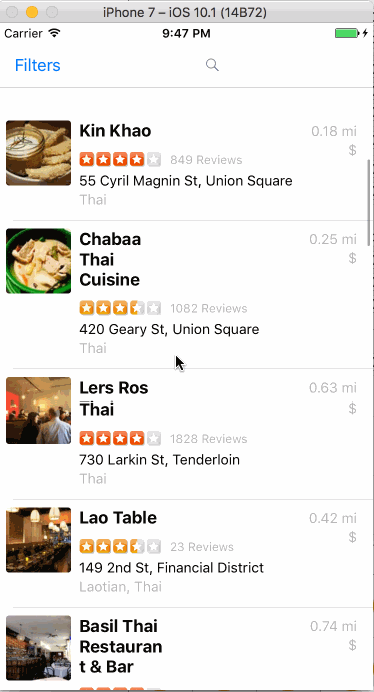

# Yelp

This is the Yelp client project.

Time spent: 10 hours spent in total

Completed user stories:

 
Search Results Page
* [x] Table rows should be dynamic height according to the content height.
* [x] Custom cells should have the proper Auto Layout constraints.
* [x] Search bar should be in the navigation bar (doesn't have to expand to show location like the real Yelp app does).

Filter Page
* [ ] The filters table should be organized into sections as in the mock: category, sort (best match, distance, highest rated), distance, deals (on/off).
* [x] Clicking on the "Search" button should dismiss the filters page and trigger the search w/ the new filter settings.
 
Notes:

Optional features not completed as focus is on completing all required assignments to catch up.
The following issues were faced:
  
  Search Results Page
    
    -Auto Layout was messed up during scrolling. The "name" label of the restaurant eventually had tiny width and large height.
  
  Filter Page
    
    -The categories table was not achievable using "static" cells. An error kept showing up in XCode that I needed a table view controller, which was present. As a result, I was not able to break up the filter into sections.

Walkthrough of all user stories:

Walkthrough starts with default Thai restaurants search. Then a filter is applied for another search. Then serach bar is used for yet another search.

GIF created with [LiceCap](http://www.cockos.com/licecap/).
